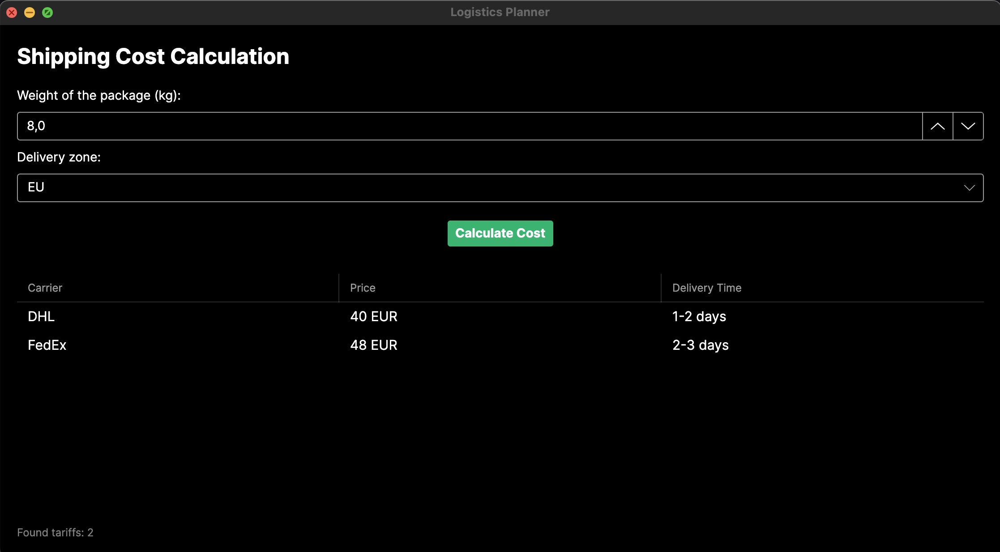
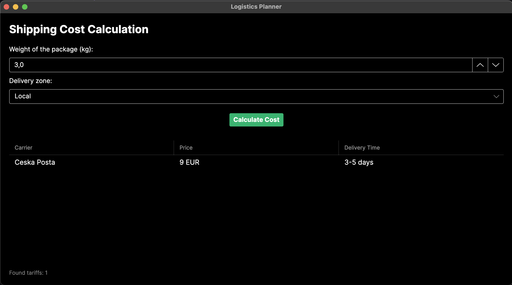
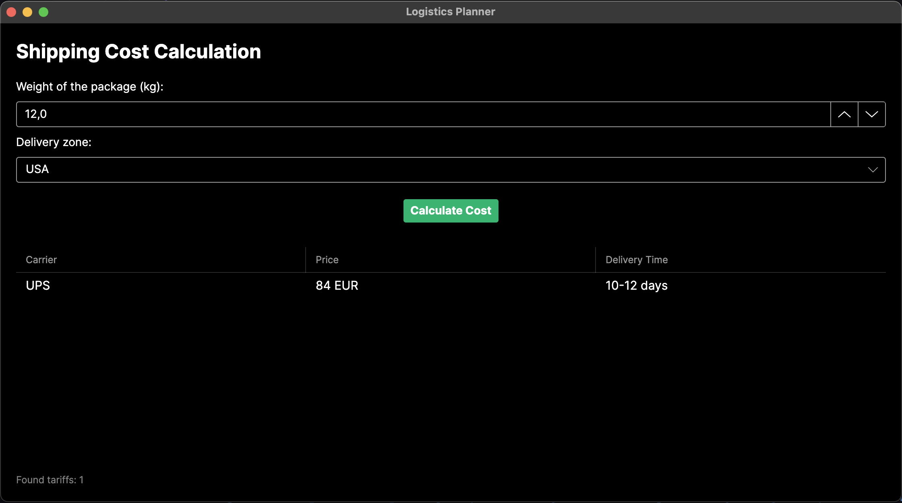

# Logistics Planner

A cross-platform desktop application designed to calculate and optimize package shipment costs. The app processes package weight and destination zones to provide a list of available carriers sorted by price.

## Features
- Calculates shipping costs dynamically based on tariff rules (min/max weight, base price limits).
- Filters available carriers by destination zone (EU, Local, USA).
- Clean, minimal user interface.

## Architecture
The solution is built using C# and .NET 9.0 and follows a strict 3-tier architecture to ensure separation of concerns:
- **Presentation Layer:** Built with Avalonia UI (XAML/C#) for cross-platform compatibility.
- **Business Logic Layer:** Contains services for filtering and cost-calculation algorithms.
- **Data Access Layer:** Implements the Repository pattern to read and deserialize tariff data from a JSON file.

## Tech Stack
- C# / .NET 9.0
- Avalonia UI

## How to Run
1. Ensure the .NET 9.0 SDK is installed on your machine.
2. Clone this repository.
3. Open a terminal in the root directory of the project.
4. Run the application using the following command:
   `dotnet run --project LogisticsPlanner/LogisticsPlanner.csproj`

## Application Appearance

